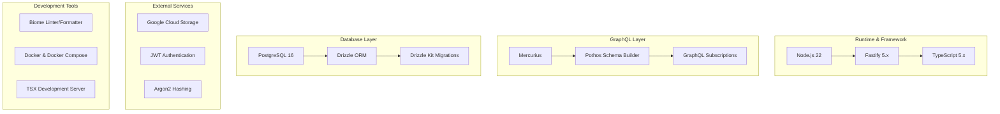
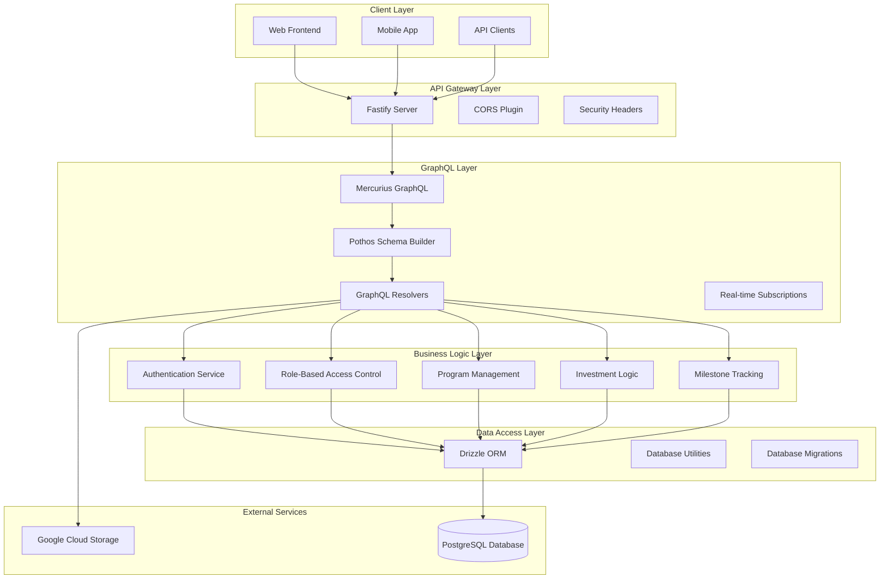
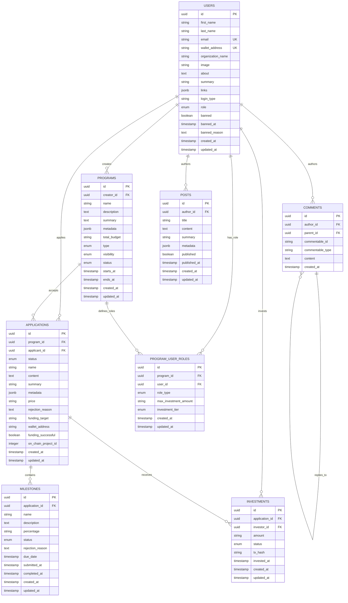
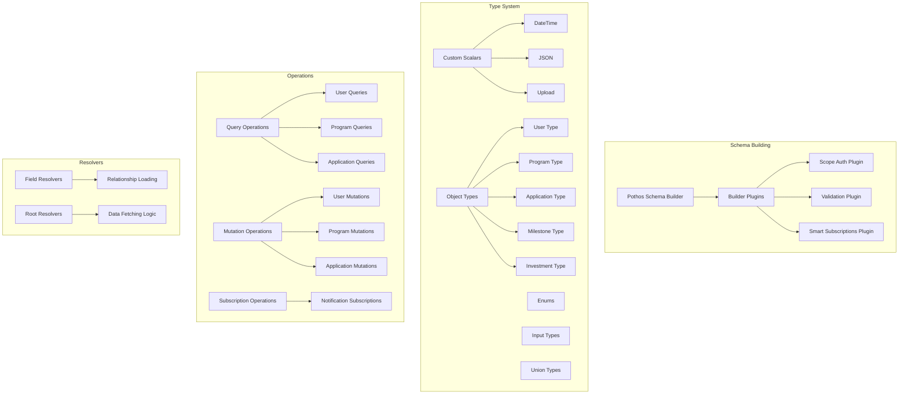
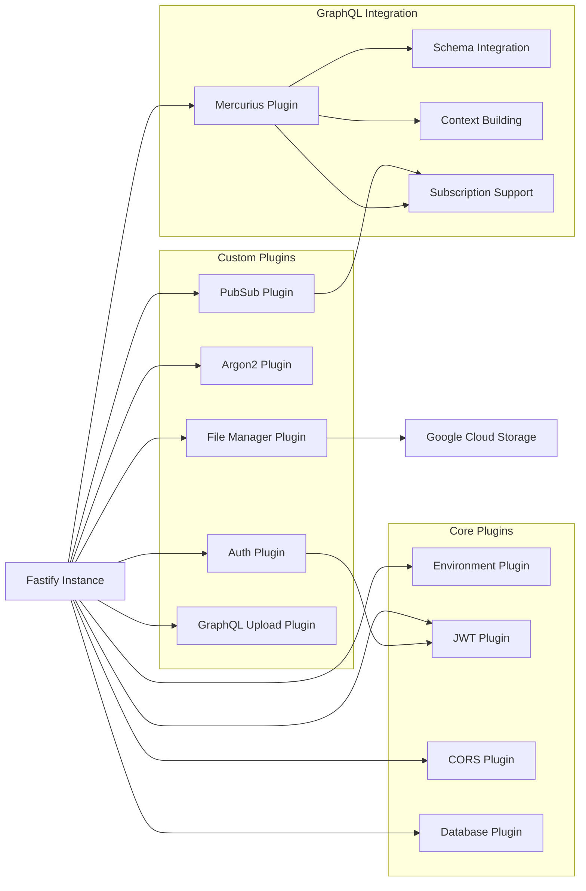
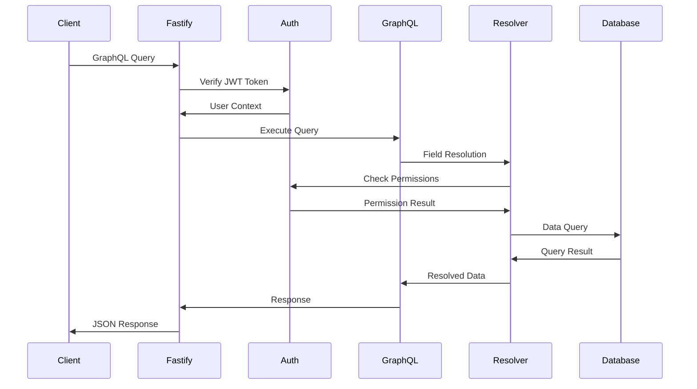
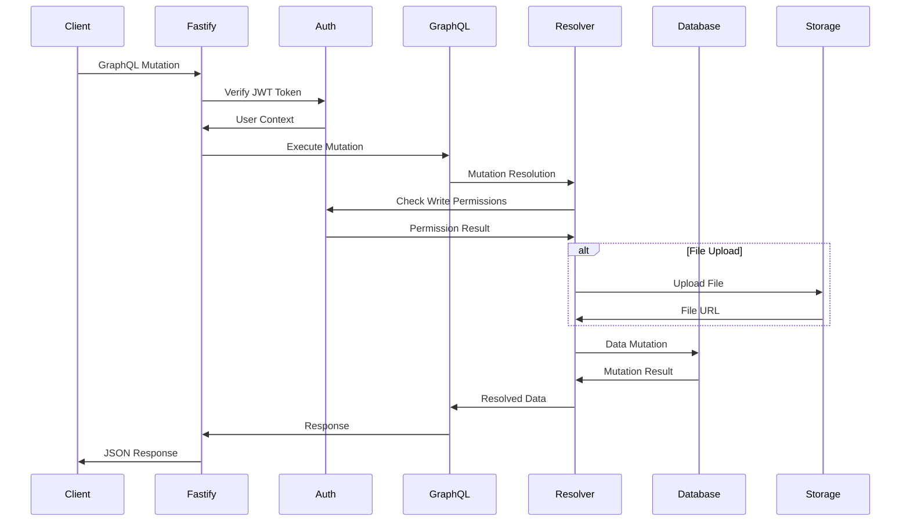
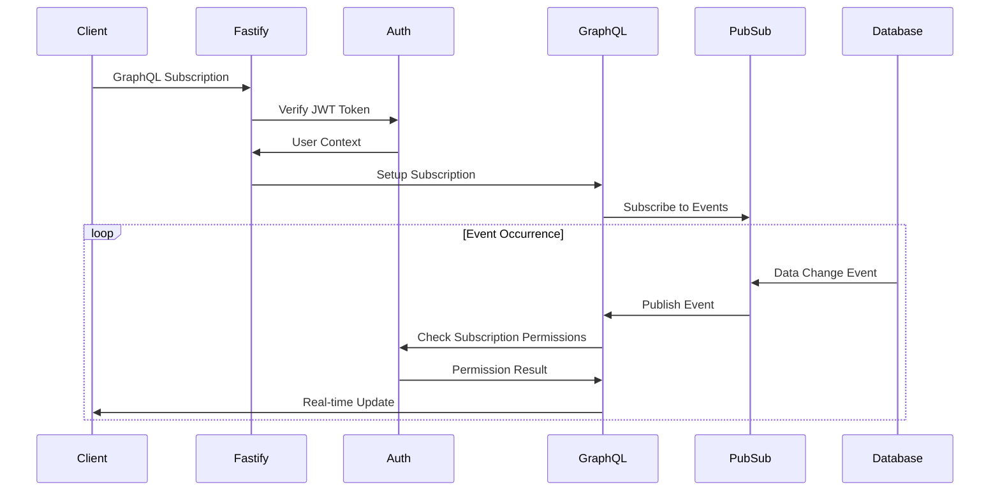
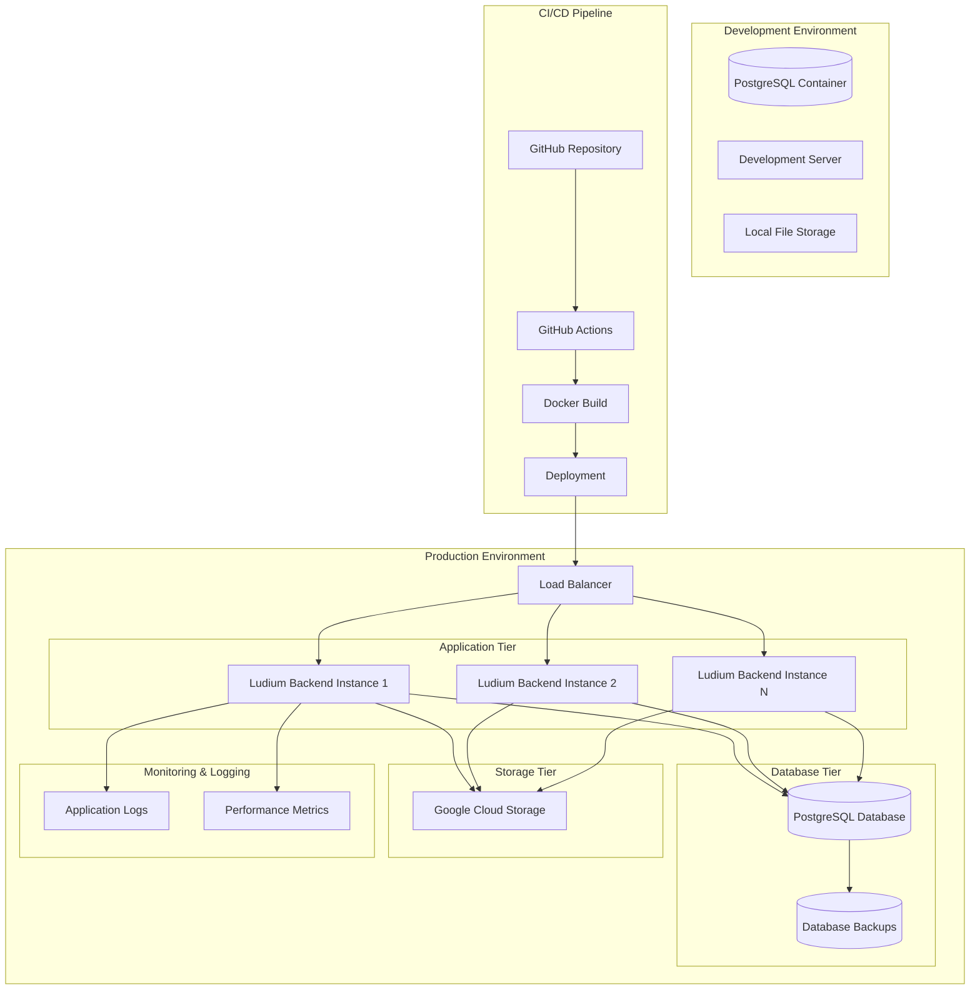

# Ludium Backend Architecture Overview

## System Overview

The Ludium Backend is a modern GraphQL API built with TypeScript, Fastify, and PostgreSQL. It serves as the backend for the Ludium platform, which manages educational programs, applications, milestones, and investment workflows in a decentralized learning ecosystem.

### Key Features
- **GraphQL API** with real-time subscriptions
- **Role-based access control** with granular permissions
- **Investment and funding management** for educational programs
- **Milestone tracking** and validation system
- **File storage** integration with Google Cloud Storage
- **JWT-based authentication** with Argon2 password hashing

## Technology Stack

## High-Level Architecture

## Application Layers

### 1. Presentation Layer (GraphQL)
- **Location**: `src/graphql/`
- **Responsibility**: API contract definition and request handling
- **Components**:
  - Schema definitions (`types/`)
  - Resolvers (`resolvers/`)
  - Builder configuration

### 2. Business Logic Layer
- **Location**: `src/utils/`, `src/services/`
- **Responsibility**: Core business rules and domain logic
- **Components**:
  - Authentication logic
  - Authorization checks
  - Program management
  - Investment calculations
  - Milestone validation

### 3. Data Access Layer
- **Location**: `src/db/`
- **Responsibility**: Database operations and data modeling
- **Components**:
  - Schema definitions
  - Migrations
  - Seed data
  - Database utilities

### 4. Infrastructure Layer
- **Location**: `src/plugins/`, `src/config/`
- **Responsibility**: External integrations and system configuration
- **Components**:
  - Database connection
  - File storage
  - Authentication plugins
  - Environment configuration

## Database Architecture

## Authentication & Authorization

```mermaid
graph TB
    subgraph "Authentication Flow"
        LOGIN[User Login] --> VERIFY[Verify Credentials]
        VERIFY --> HASH[Argon2 Hash Check]
        HASH --> JWT[Generate JWT Token]
        JWT --> RESPONSE[Return Token]
    end
    
    subgraph "Authorization Layers"
        REQUEST[Incoming Request] --> AUTH_HOOK[Auth Hook]
        AUTH_HOOK --> TOKEN_VERIFY[JWT Verification]
        TOKEN_VERIFY --> USER_CONTEXT[Set User Context]
        USER_CONTEXT --> SCOPE_CHECK[Scope Authorization]
    end
    
    subgraph "Role System"
        ADMIN[Admin Role]
        SPONSOR[Sponsor Role]
        VALIDATOR[Validator Role]
        BUILDER[Builder Role]
        USER[User Role]
        
        ADMIN --> GLOBAL_ACCESS[Global System Access]
        SPONSOR --> PROGRAM_CREATE[Create Programs]
        VALIDATOR --> MILESTONE_VALIDATE[Validate Milestones]
        BUILDER --> PROGRAM_APPLY[Apply to Programs]
        USER --> BASIC_ACCESS[Basic Platform Access]
    end
    
    subgraph "Scope-Based Permissions"
        PROGRAM_SCOPE[Program Scope]
        APPLICATION_SCOPE[Application Scope]
        MILESTONE_SCOPE[Milestone Scope]
        
        PROGRAM_SCOPE --> PROGRAM_CREATOR[Program Creator]
        PROGRAM_SCOPE --> PROGRAM_VALIDATOR[Program Validator]
        PROGRAM_SCOPE --> PROGRAM_PARTICIPANT[Program Participant]
        
        APPLICATION_SCOPE --> APPLICATION_BUILDER[Application Builder]
        
        MILESTONE_SCOPE --> MILESTONE_BUILDER[Milestone Builder]
    end
```

### User Roles & Permissions

| Role | Global Permissions | Scoped Permissions |
|------|-------------------|-------------------|
| **Admin** | Full system access, user management | All program/application operations |
| **Sponsor** | Create programs, manage own programs | Program creator permissions |
| **Validator** | Validate programs and milestones | Program validator permissions |
| **Builder** | Apply to programs, submit milestones | Application builder permissions |
| **User** | Basic platform access | Read-only access to public content |

## GraphQL Schema Architecture

## Plugin System

### Plugin Descriptions

| Plugin | Purpose | Dependencies |
|--------|---------|--------------|
| **Environment** | Load and validate environment variables | `@fastify/env` |
| **JWT** | JWT token generation and verification | `@fastify/jwt` |
| **Database** | PostgreSQL connection and Drizzle ORM setup | `drizzle-orm`, `postgres` |
| **Auth** | Authentication hooks and role-based authorization | JWT Plugin |
| **Argon2** | Password hashing and verification | `@node-rs/argon2` |
| **File Manager** | File upload and storage management | Google Cloud Storage |
| **PubSub** | Real-time subscription management | `graphql-subscriptions` |
| **GraphQL Upload** | File upload support in GraphQL | `graphql-upload-minimal` |

## Data Flow

### Query Flow

### Mutation Flow

### Subscription Flow

## Deployment Architecture

